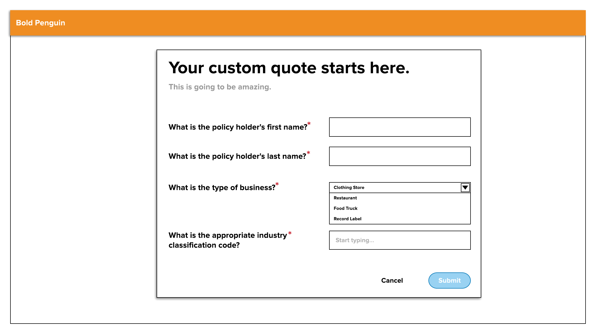

# A little background information

This code exercise is intended to evaluate your software engineering skills but also give you an introduction into the types of problems we solve at Bold Penguin. Your solution will be evaluated based on the ability to produce intended results, cleanliness, adherence to best practices, maintainability, and readability. You should write code like you would if this were an actual assignment. You do not need to gold plate your solution, but we are looking for something more than a script.  Ideally your solution would demonstrate your understand of object-oriented principles and best practices (don't forget your tests!).

# The Dynamic Form Generation Problem

One of the problems Bold Penguin helps solve is matching business owners (who are looking to purchase a commercial insurance policy) with an agent & and a carrier who can help them.

To this end, Bold Penguin writes software that asks questions about the business to be insured so to determine an agent/carrier match for the particular business/owner.

The goal is to provide a path that provides a user experience short in duration while also providing the most accurate match.  We use question sets that are generated from a set of rules data provided by agents and carriers.

## Getting Started

Clone **this** repo, please don't make a fork of it.

You'll need to setup your development environment with Javascript and Angular. This step is platform dependent, so you'll need to figure it out yourself.

## The API

Another team (the Pengwinners) is working on a series of API endpoints to generate a dynamic form. The form is intended to collect data from a small business owner about their business. There are a few endpoints that you will need to use for this assignment:

### GET https://pengwinning.boldpenguin.com/api/questions

This retrieves a list of questions that the consumer must answer. The questions have some indication of the types of HTML elements that are to be used.

```bash
$ curl -XGET https://pengwinning.boldpenguin.com/api/questions -H 'Authorization: Bearer xxxxxxxx'
```

### GET https://pengwinning.boldpenguin.com/api/naics/search?q=XXX

This endpoint filters NAICS (North American Industry Classification System) for industry classification codes that match the query string (e.g. the q parameter).

```bash
$ curl -XGET https://pengwinning.boldpenguin.com/api/naics/search?q=te -H 'Authorization: Bearer xxxxxxxx'
```

### POST https://pengwinning.boldpenguin.com/api/application_forms

This endpoint saves an application form (which is essentially the answers to the questions described in the `api/questions` endpint.

```bash
$ curl -XPOST https://pengwinning.boldpenguin.com/api/application_forms \
  -H 'Authorization: Bearer xxxxxxxx' \
  -H 'Content-Type: application/json' \
  --data '{"responses":[{"question_id":1,"text":"John"},{"question_id":2,"text":"Doe"},{"question_id":3,"option_id":1},{"question_id":4,"text":"123433"}]}'
```


## Authentication

Like many modern web application, we use stateless authentication. In order to authenticate successfully, you'll need to supply a request header with the bearer scheme. The bearer token has been given to you on the api service.

## Your Assignment

You are going to build a dynamically generated user input form. In addition to this wireframe, please see the requirements below.



**After completing each of the steps below, commit your changes to your local clone with a meaningful commit message.**

Notice that an injectible service has been created for you, and Angular Material has been added as a dependency. Using these components, please complete the tasks below.

1. Using Angular Material Form Controls, make a form component that consumes a list of questions from the questions api and dynamically generates a form based on that data.  This dynamic form should be able to accomodate N questions in whatever order they are configured in the data.

2. Using the search api, add NAICS search functionality to the classification code question.

3. Add the ability to submit user answers to the application forms endpoint

4. Complete the questions in `QUESTIONS.md`.

## How this will be evaluated

For clarity, this is how your code sample will be evaluated:

| Criteria | Percentage |
|----------|-----|
| Object-Oriented Design Principles | 30% |
| Readabiltiy & Maintainability | 30% |
| Best Practices & Naming Convention | 20% |
| Ease of Testing Solution & Correctness | 20% |

## Submission guideliness

**Please don't push your work to a public fork on GitHub!**

Using the command below, create a git bundle of your changes and send it to `front-end-code-test@boldpenguin.com` with the subject line `[DYNAMIC_FORM] <your name>`. **This subject line is VERY important! Without using it exactly, there may be delays in scheduling next steps**

Also, if you are using an external recruiter, please CC them on the submission so that they can see it too!

```bash
$ git bundle create your_name.bundle master
```

<br/>
<br/>
<br/>


# DynamicFormGeneration

This project was generated with [Angular CLI](https://github.com/angular/angular-cli) version 7.3.0.

## Development server

Run `ng serve` for a dev server. Navigate to `http://localhost:4200/`. The app will automatically reload if you change any of the source files.

## Code scaffolding

Run `ng generate component component-name` to generate a new component. You can also use `ng generate directive|pipe|service|class|guard|interface|enum|module`.

## Build

Run `ng build` to build the project. The build artifacts will be stored in the `dist/` directory. Use the `--prod` flag for a production build.

## Running unit tests

Run `ng test` to execute the unit tests via [Karma](https://karma-runner.github.io).

## Running end-to-end tests

Run `ng e2e` to execute the end-to-end tests via [Protractor](http://www.protractortest.org/).

## Further help

To get more help on the Angular CLI use `ng help` or go check out the [Angular CLI README](https://github.com/angular/angular-cli/blob/master/README.md).
